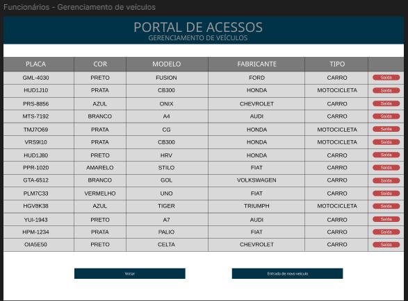

Especificação dos Requisitos do

Software - ERSw 

**“In-PUC-Out”** 

**4º período** 

**PUC MINAS 
Sistemas de Informação** 

**Data:  30/09/2024**   

**Versão 1.0** 

**Histórico de Revisões do Documento** 

|**Versão** |**Data** |**Descrição** |**Autor** |
| - | - | - | - |
|1\.0 |25/09/2024 |Criação do documento |Felipe Fernandes |
|1\.0 |25/09/2024 |Classificação dos requisitos |Felipe Fernandes  |
|1\.0 |27/09/2024 |MER (Modelo entidade relacionamento) |Higor |
|1\.0 |28/09/2024 |Historias de usuários |Matheus |
|1\.0 |28/09/2024 |Prototipação das telas |Pedro Arley |
|1\.0 |29/09/2024 |Adicionei e modifiquei requisitos funcionais |Matheus |
|2\.0 |07/12/2024 |Adicionei casos de uso |Rafael |
|2\.0 |08/12/2024 |Adicionei diagrama de classes e diagrama de atividades |Rafael |
|2\.0 |08/12/2024 |Alterei histórico de revisão do documento e adicionei descrição das classes  |Matheus |
|2\.0 |09/12/2024 |Adicionei descrição dos casos de uso |Matheus |
|2\.0 |10/12/2024 |Atualizei o sumário |Matheus |

**Aprovação do documento** 

|**Versão** |**Data** |**Nome da pessoa** |**Papel perante o sistema** |
| - | - | - | - |
|||||
|||||
`  `[ a ser preenchido pela professora]   

25 

3 

**SUMÁRIO**

1. **INTRODUÇÃO............................................................................................................................................... 3**
1. PROPÓSITO DO DOCUMENTO DE REQUISITOS ................................................................................................. 3
1. PÚBLICO-ALVO .............................................................................................................................................. 3
2. **DESCRIÇÃO GERAL ................................................................................................................................... 3**
1. SITUAÇÃO ATUAL .......................................................................................................................................... 3
1. RESTRIÇÕES DE HARDWARE E SOFTWARE .................................................................................................... 3
3. **REQUISITOS ................................................................................................................................................. 4**
1. REQUISITOS FUNCIONAIS - RF ....................................................................................................................... 4
1. REQUISITOS NÃO FUNCIONAIS - RNF ............................................................................................................ 5
4. **REGRAS DE NEGÓCIO ............................................................................................................................... 5**

4\.1  REGRAS DE NEGÓCIO (RN) ........................................................................................................................... 5

5. **STAKEHOLDERS ......................................................................................................................................... 5**
1. USUÁRIOS...................................................................................................................................................... 5

*5.1.1  Responsabilidades ................................................................................................................................ 6*

2. EQUIPE DE TI ................................................................................................................................................. 6
3. DEMAIS STAKEHOLDERS ............................................................................................................................... 6
6. **DIAGRAMA ENTIDADE RELACIONAMENTO (DER) ......................................................................... 7**
7. **CASOS DE USO (CSU) – A SER FEITO NA 2ª PARTE ........................................................................... 7**
1. DIAGRAMA DE CASOS DE USO (USE CASE DIAGRAM) .................................................................................. 7
1. DESCRIÇÃO DOS CASOS DE USO .................................................................................................................... 8
8. **DIAGRAMA DE CLASSES – A SER FEITO NA 2ª PARTE ................................................................... 9**
1. DIAGRAMA DE CLASSES ................................................................................................................................ 9
1. DESCRIÇÃO DAS CLASSES ............................................................................................................................ 10
9. **DIAGRAMA DE ATIVIDADES – A SER FEITO NA 2ª PARTE .......................................................... 10**
9. **PROTOTIPAÇÃO ........................................................................................................................................ 11**
9. **HISTÓRIAS DE USUÁRIO ........................................................................................................................ 16**

**1.Introdução ![ref1]**

1. **Propósito do documento de requisitos** 

Esse documento tem o objetivo de detalhar os requisitos dos usuários que deverão ser atendidos  pelo  sistema  a  ser  construído  nesse  projeto.  Ele  servirá  como  base  para  a construção do sistema por parte dos programadores. Aqui estará presente uma descrição detalhada das funções do produto, de suas interfaces e do comportamento esperado do sistema. 

2. **Público-alvo** 

Este  documento  destina-se  ao  time  de  desenvolvedores  de  software  bem  como  os stakeholders envolvidos no processo de construção do aplicativo. 

**2.Descrição Geral **

Este documento contém a especificação de requisitos para atender a A PUC Minas  que deseja construir uma aplicação WebApp para facilitar e agilizar o controle de acesso de veículos aos seus estacionamentos de todas as suas unidades Coração Eucarístico, Lourdes, Contagem, Barreiro, Betim, Poços de caldas e São Gabriel, com o intuito de prover mais segurança  e  comodidade  para  os  seus  usuários. 

1. **Situação atual** 

Cada  unidade  tem  várias  portarias  (acessos  1,2,3  etc)  e  cada  uma  delas  possui  uma quantidade  limitada  de  vagas  (capacidade  de  veículos  –  carros  e  motos). 

2. **Restrições de Hardware e Software** 

[E**xemplo - HARDWARE:** descrever a quantidade de memória requerida, espaço para armazenamento, softwares dependentes, dispositivo de hardware a ser integrado – impressora cupom fiscal.] 

O software deverá ser integrado com o SGA para preenchimento automático das informações do aluno 

**3.Requisitos **

1. **Requisitos funcionais - RF** 

|**Código** |**Nome** |**Depende de** |**Descrição** |**Prioridade** |
| - | - | - | - | - |
|RF 01 |Cadastro de Usuário ||Permitir que usuários se cadastrem com nome, endereço, telefone, tipo (aluno, professor, funcionário, visitante) e número de pessoa. |Essencial |
|RF 02 |Autocompletar Cadastro ||Integrar com o SGA para preencher automaticamente os |Essencial |

||||dados do usuário com base no número de pessoa. ||
| :- | :- | :- | :- | :- |
|RF 03  |Cadastro de Veículos |RF 01 |Permitir que usuários cadastrem múltiplos veículos (placa, cor, modelo, fabricante). |Essencial |
|RF 04 |Registro de Entrada |RF 01, RF 03 |Registrar a entrada caso o usuário não tenha nenhum veículo dentro de alguma puc e saída de veículos pelo vigilante informando a placa e confirmar o nome do proprietário, armazenar o dia e horário da entrada de veículos, atualizar o número de vagas.  |Essencial |
|RF 05 |Registro de Saída |RF 01, RF 03, RF 04 |Registrar a saída de veículos pelo vigilante informando a placa e confirmar o nome do proprietário, armazenar o dia e horário da saída de veículos, atualizar o número de vagas. |Essencial |
|RF 06 |Cadastro de Visitantes ||Permitir cadastro de visitantes no momento da entrada. |Essencial |
|RF 07 |Controle de Vagas |RF 03, RF 04, RF 05 |Consultar disponibilidade de vagas em tempo real|Essencial |
|RF 08 |Consulta de veículos  |RF 03, RF 04, RF 05 |Consultar quais os veículos estão, ou estiveram, dentro da PUC Minas em um determinado dia e horário por meio do armazenamento de um histórico ||
|RF 09 |Login |RF 01, RF 03 |Fazer login no sistema |Essencial |

2. **Requisitos não funcionais - RNF** 

|**Código** |
**Classificação  (externo, produto ou** 

**organizacional)**
|**Descrição** |
| - | :- | - |
|RNF 01 |Desempenho |O sistema deve ser capaz de suportar pelo menos 1000 acessos simultâneos sem degradação de performance. |
|RNF 02 |Usabilidade |A interface deve ser intuitiva, permitindo que vigilantes realizem as operações de forma rápida. |
|RNF 03 |Segurança |As informações dos usuários e veículos devem ser armazenadas de forma segura, com criptografia dos dados sensíveis. |
|RNF 04 |Escalabilidade |O sistema deve permitir adição de novas unidades e portarias sem necessidade de reestruturação. |
|RNF 05 |Compatibilidade |O sistema deve ser compatível com os principais navegadores (Chrome, Firefox, Safari, Edge). |

**4. Regras de Negócio  **

**4.1 Regras de Negócio (RN)** 

|**Código**  |**Descrição** |
| - | - |
|RN 01 |Usuários devem realizar cadastro completo para utilizar o estacionamento. |
|RN 02 |Apenas um veículo por usuário pode estar dentro da PUC Minas ao mesmo tempo. |
|RN 03 |Visitantes precisam ser cadastrados no momento da entrada. |
|RN 04 |O vigilante deve confirmar a identidade do proprietário pelo nome associado à placa do veículo. |
|RN 05 |O sistema deve sempre atualizar o número de vagas disponíveis em tempo real após cada entrada ou saída. |

***5.Stakeholders ***

Usuário:  Usuário do  estacionamento (aluno, professor, coordenador, visitante, palestrante, funcionário da puc), vigilantes do estacionamento, gerente do estacionamento. 

Equipe: Programadores, designer, tester’s, analistas, DBA’s, engenheiro de softwares. 

1. **Usuários** 

|**Função/ Cargo / Papel** |**Nome** |**Contato** |
| - | - | - |
|Aluno|Várias pessoas |- |
|Professores|Várias pessoas |- |
|Funcionário|Várias pessoas |- |
|Segurança terceirizada|Várias pessoas |- |
|Visitante |Várias pessoas |- |

**5.1.1 Responsabilidades** 

|**Nº** |**Requisito funcional**  |***Stakeholder*  primário** |***Stakeholder* secundário** |
| - | - | :-: | - |
|RF01 |Cadastro de usuário |Usuário |Vigilantes |
|RF02 |Autocompletar cadastro |Usuário |Não se aplica |
|RF03 |Cadastro de veículo |Usuário |Vigilantes |
|RF04 |Registro de entrada  |Usuário |Vigilantes |
|RF05 |Registro de saída |Usuário |Vigilante |
|RF06 |Cadastro de visitante |Visitante |Vigilante |
|RF07 |Controle de vagas |Vigilante |Usuário |

|RF08 |Consulta de veículos |Vigilante |Gerente do estacionamento |
| - | - | - | :- |
|RF09 |Fazer login |Usuário |Não se aplica |

2. **Equipe de TI** 

|**Função** |**Nome** |**Contato** |
| - | - | - |
|Designer |Pedro Arley Paes Maia||
|Analista |Higor Antônio da Silva||
|Programador |Matheus  Henrique  Marques Canuto||
|Tester  |Felipe  Fernandes  de  Bellis Ruas||
|Tester |Pedro Henrique Silva Matta ||
|Engenheiro de software |Rafael  Romagnoli  Conforte Cesário ||
3. **Demais *stakeholders*** 

|**Nome** |**Descrição** |**Contato** |
| - | - | - |
|Amália  Soáres  Vieira  de Vasconcelos  (Como  cliente que  está  representando  a PUC) |Professora|(031) 98574-5924 |
|Fábio  Leandro  Rodrigues Cordeiro  (Como  cliente  que está representando a PUC) |Coordenador  do  curso  de ADS|(031) 99917-6441 |
|Luciana  Mara Freitas (Como cliente  que  está representando a PUC) |Professora |(031) 92404-8521 |
||||
**6. Diagrama Entidade Relacionamento (DER) ![ref1]**

**7.Casos de Uso (CSU) – A SER FEITO NA 2ª PARTE **

1. **Diagrama de Casos de Uso (*Use Case Diagram*)** 

2. **Descrição dos Casos de Uso.** 

EXEMPLO: 

|Código e nome |**CSU 01: Cadastrar usuário** |
| - | - |
|Descrição |O ator (usuário) acessa a interface para realizar o cadastro no sistema |
|Ator (es) |Primário: Usuário Secundário: Professor e aluno |
|Pré-condições  |Não tem |
|Prioridade |Essencial |

|Código e nome |**CSU 01: Cadastrar usuário** |
| - | - |
|Fluxo principal Fluxo alternativo |
1. O usuário digita a URL no navegador 

2. O usuário digita os seus dados (Nome, endereço, telefone e ~~matrícula)~~ 

2\. Cadastrar com conta SGA 

a) O sistema fornece a opção de utilizar uma conta SGA 
|
|Fluxo de exceção |
2\. Dados incorretos 

a) O sistema irá mostrar uma mensagem informando ao usuário que algum dado está incorreto 

b) O usuário inicia novamente o seu cadastro 
|
|Pós-condições |` `Criação de usuário bem-sucedida, faça login |
|Regras de negócio |RN01 e RN03 |

|Código e nome |**CSU 02: Fazer Login no sistema** |
| - | - |
|Descrição |Cada usuário deve informar e-mail e senha. |
|Ator (es) |Primário: Usuário Secundário: Professor e aluno |
|Pré-condições  |O usuário precisa estar cadastrado no sistema |
|Prioridade |Essencial |
|Fluxo principal|
1. O usuário digita a URL no navegador. 

2. O usuário digita o e-mail e a senha.

3. O usuário clica no botão ENTRAR
|
|Fluxo alternativo |
2\. Login com conta SGA 

a) O sistema fornece a opção de utilizar uma conta SGA 
|

|Fluxo de exceção |
2\. Dados incorretos 

a) O sistema irá mostrar uma mensagem informando ao usuário que algum dado está incorreto 

b) O usuário inicia novamente o seu login 
|
| - | - |
|Pós-condições |Acesso ao sistema liberado |
|Regras de negócio ||
COPIAR E COLAR O QUADRO ACIMA PARA OS CASOS DE USO! 

|Código e nome |**CSU 03: Integrar com SGA** |
| - | - |
|Descrição |O usuário cadastra com os dados do SGA |
|Ator (es) |Primário: Usuário Secundário: Professor e aluno |
|Pré-condições  |Ter uma conta ativa no SGA |
|Prioridade |Média |
|Fluxo principal|
1. O usuário digita a URL no navegador. 

2. O usuário clica em “Entrar pelo SGA” 

2. O usuário digita o e-mail e a senha.

3. O usuário clica no botão ENTRAR
|
|Fluxo alternativo ||
|Fluxo de exceção |
2\. Dados incorretos 

a) O sistema irá mostrar uma mensagem informando ao usuário que 

o e-mail digitado não existe/não está ativo na base de dados do SGA 

b) O usuário inicia novamente o seu login 
|
|Pós-condições |Acesso ao sistema liberado |
|Regras de negócio ||

|Código e nome |**CSU 04: Cadastrar veículo** |
| - | - |
|Descrição |O usuário cadastra um ou mais veículos que vão estar estacionados na PUC |
|Ator (es) |Primário: Usuário Secundário: Professor e aluno |
|Pré-condições  |Ter cadastro no sistema |
|Prioridade |Alta|
|Fluxo principal|
1. O usuário digita a URL no navegador. 

2. O usuário faz login 

3. O usuário clica em cadastrar carro 

4. O usuário entra com os dados do carro 
|
|Fluxo alternativo |
**2) O usuário não tem um login** 

a) Usuário cadastra no sistema e volta para o passo 2 
|
|Fluxo de exceção |
2\. Dados incorretos 

a) O sistema irá mostrar uma mensagem informando ao usuário que 

o e-mail digitado não existe/não está ativo na base de dados do SGA 

b) O usuário inicia novamente o seu login 
|
|Pós-condições |O usuário pode entrar com o carro no estacionamento de qualquer puc |
|Regras de negócio ||

|Código e nome |**CSU 05: Cadastrar visitante** |
| - | - |
|Descrição |O funcionario cadastra um visitante para que ele possa utilizar o estacionamento|
|Ator (es) |Primário: Funcionario |

|Pré-condições  ||
| - | :- |
|Prioridade |Alta|
|Fluxo principal|
1. O usuário digita a URL no navegador. 

2. O usuário faz login 

3. O usuário clica em cadastrar um visitante 

4. Visitante acessa o site 

5. Visitante faz login 
|
|Fluxo alternativo |
**3) O visitante já tem cadastro** 

a) Pula para o passo 4 
|
|Fluxo de exceção |
2\. Usuário já tem cadastro 

a) O sistema irá mostrar uma mensagem informando que o visitante já tem login 

b) Visitante faz login 
|
|Pós-condições |O usuário pode entrar com o carro no estacionamento de qualquer puc |
|Regras de negócio |RN03 |

|Código e nome |**CSU 06: Registrar entrada e saída** |
| - | - |
|Descrição |Um funcionário registra a entrada e a saída de um veículo no estacionamento |
|Ator (es) |Primário: Funcionário Secundário: Usuário |
|Pré-condições  |Usuário ter que estar cadastrado e tem que ter cadastrado o veículo |
|Prioridade |Alta|
|Fluxo principal|
1. O usuário digita a URL no navegador. 

2. O usuário faz login 

3. O usuário clica em “Registrar entrada / saída” 

4. O usuário pesquisa um veículo pela placa 
|

||5\. O usuário clica em registrar entrada/saída do veículo |
| :- | - |
|Fluxo alternativo |
**4) O usuario pesquisa o veículo pelo Renavam** 

A) O usuário clica em registrar entrada/saída do veículo 
|
|Fluxo de exceção |
**4) O usuário não tem o veículo cadastrado** 

a) Processo encerrado, o usuário deve realizar o cadastro do veículo 
|
|Pós-condições |O usuário pode entrar ou sair com o veículo da PUC |
|Regras de negócio |RN02, RN05 |

|Código e nome |**CSU 07: Consultar disponibilidade tempo real** |
| - | - |
|Descrição |Um funcionário acessa a dashboard do sistema para verificar a quantidade de vagas disponíveis na puc |
|Ator (es) |Primário: Funcionário Secundário: Usuário |
|Pré-condições  |O funcionário deve ter seu cadastro ativo |
|Prioridade |Alta|
|Fluxo principal|
1. O usuário digita a URL no navegador. 

2. O usuário faz login 

3. O usuário acessa a dashboard do sistema 
|

|||
| :- | :- |
|Fluxo alternativo ||
|Fluxo de exceção |
**4) O funcionário não está com o seu cadastro ativo** 

a) Verificar o seu cadastro com o gerente do estacionamento 
|
|Pós-condições |O  funcionário  sabe  a  quantidade  de  vagas  disponíveis  no estacionamento |
|Regras de negócio ||

|Código e nome |**CSU 08: Consultar veículos que entraram na puc** |
| - | - |
|Descrição |Um funcionário acessa a dashboard do sistema para verificar a quantidade de veículos que entraram na puc |
|Ator (es) |Primário: Funcionário Secundário: Usuário |
|Pré-condições  |O funcionário deve ter seu cadastro ativo |
|Prioridade |Alta|
|Fluxo principal|
1. O usuário digita a URL no navegador. 

2. O usuário faz login 

3. O usuário acessa a dashboard do sistema 
|

|||
| :- | :- |
|Fluxo alternativo ||
|Fluxo de exceção |
**4) O funcionário não está com o seu cadastro ativo** 

a) Verificar o seu cadastro com o gerente do estacionamento 
|
|Pós-condições |O funcionário sabe a quantidade de veículo que entraram na puc naquele dia |
|Regras de negócio ||
**8. Diagrama de classes – A SER FEITO NA 2ª PARTE **

1. **Diagrama de classes** 

2. **Descrição das classes** 

1\. Classes e atributos Usuário:  

nome: String, nome completo do usuário. endereco: String, endereço residencial. telefone: String, número de telefone do usuário. matricula: String, identificador único do usuário. 

Visitante:  

nome: String, nome completo do visitante. 

identificacao: String, documento ou número de identificação do visitante. 

Veículo:  

placa: String, identificador único do veículo. 

cor: String, cor do veículo. 

modelo: String, modelo do veículo. 

fabricante: String, fabricante do veículo. 

dono: Referência ao usuário proprietário do veículo. 

Registro:  

dataEntrada: Date, data de entrada no estacionamento. horaEntrada: Time, horário de entrada no estacionamento. dataSaida: Date, data de saída do estacionamento. 

Estacionamento: 

numeroVagas: Integer, quantidade de vagas disponiveis. unidade: String, de qual unidade é aquele estacionamento. portaria: Integer, define qual é a portaria. 

Vaga:  

ID: Integer, identificador único da vaga. 

status: Boolean, indica se a vaga está ocupada ou livre. 

3. Métodos 

`    `Usuário: 

`        `cadastrarUsuario(): Registra um novo usuário no sistema.         fazerLogin(): Realiza a autenticação do usuário. 

`    `Visitante: 

`        `cadastrarVisitante(): Registra um visitante no sistema. 

`    `Veículo: 

`        `cadastrarVeiculo(): Registra um novo veículo no sistema. 

`        `consultarVeiculo(): Retorna informações sobre um veículo cadastrado. 

Registro: 

`        `registrarEntrada():  Registra  a  entrada  de  um  veículo  ou  visitante  no estacionamento. 

`        `registrarSaida(): Registra a saída de um veículo ou visitante do estacionamento.     Estacionamento: 

`        `atualizarVagas():  Atualiza  as  informações  sobre  as  vagas  disponíveis  no estacionamento. 

consultarVagas(): Retorna as vagas disponíveis no estacionamento. 

`    `Vaga: 

`        `verificarDisponibilidade(): Retorna o status de disponibilidade da vaga. 

4. Relacionamentos entre Classes 

Usuário: Associado a Veículo com multiplicidade 1:N (um usuário pode ter vários veículos). 

Visitante: Associado a Registro com multiplicidade N:1 (vários visitantes podem ter um único registro de entrada/saída). 

Veículo: Associado a Registro com multiplicidade N:1 (vários registros podem estar vinculados a um único veículo). 

Estacionamento: Associado a Vaga com multiplicidade 1:N (um estacionamento pode ter várias vagas). 

**9.Diagrama de atividades – A SER FEITO NA 2ª PARTE **

**10.Prototipação **

Sugestão de ferramenta: Marvel App e Figma. Utilizado a ferramenta figma. Link: 

https://www.figma.com/design/eQ2KrWMXkEShUdlgrFY5mG/Engenharia-de- Requisitos?node-id=0-1&node-type=canvas 

Tela 1 – Login 

Tela 2 – Cadastro de usuários 

Tela 3 - Página inicial (Alunos) 

90 

Tela 4 - Página inicial (Funcionários) 

Tela 5 – Gerenciamento de veículos (Funcionários) 

Tela 6 – Cadastro de veículos (Funcionários) 

Tela 7 - Gerenciamento para entrada de veículos (Funcionários) 

Tela 8 – Gerenciamento para entrada de visitantes (Funcionários) 

Tela 9 – Fale conosco (geral) 

**11. Histórias de Usuário  **

HST 01: Como vigilante, eu gostaria de registrar a entrada e a saída de veiculos, para fazer o controle de uso da estacionamento. 

HST  02:  Como  vigilante,  eu  gostaria  que  cada  usuário  do  estacionamento  cadastre  suas informações pessoais, para no caso de alguma ocorrência eu consiga possível localizar o dono do veículo. 

HST 03: Como vigilante, eu gostaria de inserir a placa do veículo e o sistema me informar o nome do proprietário para confirmação, para no caso de alguma ocorrência eu consiga possível localizar o dono do veículo. 

HST 04: Como visitante, eu gostaria de fazer o cadastro no momento da entrada, para manter o estacionamento seguro. 

HST 05: Como vigilante, eu quero consultar quais veículos estiveram dentro da PUC em um determinado dia e horário, para uma futura consulta da polícia (ocorrência que envolve algum veículo) 

HST 06:  Como vigilante, eu quero que quando eu der entrada ou saída em um veículo no estacionamento  o  sistema  atualize  o  número  de  vagas,  para  o  melhor  controle  do estacionamento. 

HST 07: Como diretor do estacionamento, eu quero que um usuário não consiga ter múltiplos acessos à universidade, para que um usuário não use a vaga do outro. 

HST 08: Como vigilante, eu quero que a data e a hora da entrada e saída de um usuário sejam registradas no sistema, para ter um registro no caso de uma ocorrência futura. 

HST 09: Como usuário do estacionamento, eu quero fazer login na plataforma, para poder utilizar o estacionamento. 
Documento de Requisitos   10/12/2024 

[ref1]: Aspose.Words.37fe3473-600c-4849-8fb5-39aa56d29e6f.004.png
